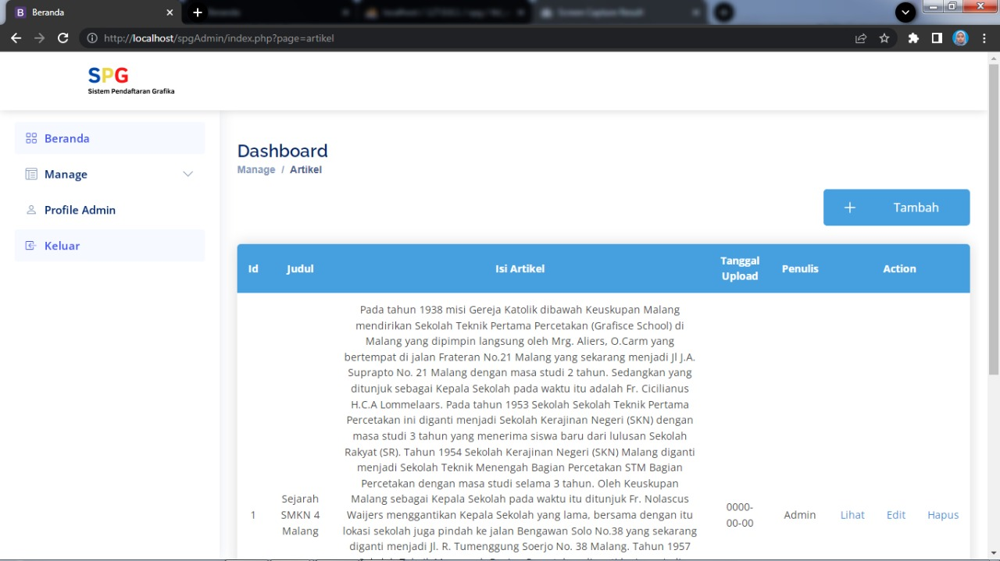

# Admin Sistem Pendaftaran Grafika
Sistem ini dibuat untuk memudahkan admin mengelola data SPG, salah satunya data artikel, sistem ini masih sangat sederhana dibuat menggunakan **`HTML`**, **`CSS`**, dan **`PHP`** serta menggunakan database **`MySQL`**.

### Ketika mengelola data Artikel Admin dapat:
* Menambahkan artikel,
* Melihat artikel,
* Mengedit artikel, dan
* Menghapus artikel.

_Tampilan User dan Guest bisa dilihat di: https://github.com/rachelliacs/Web_SPG.git_

### Preview

